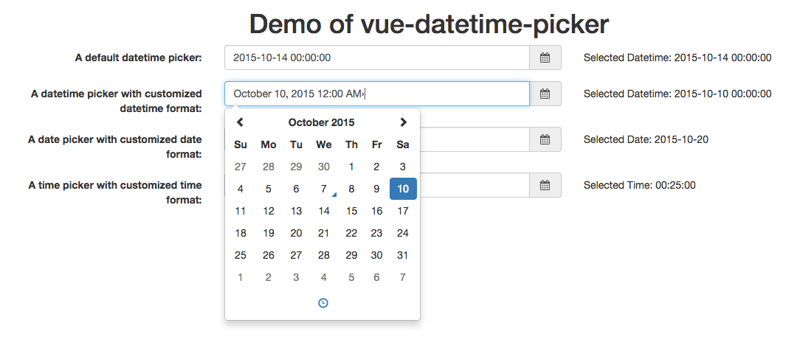

# vue-datetime-picker

[](https://circleci.com/gh/Haixing-Hu/vue-datetime-picker/tree/master)
[](https://coveralls.io/github/Haixing-Hu/vue-datetime-picker?branch=master)
[](https://www.bithound.io/github/Haixing-Hu/vue-datetime-picker)
[](https://david-dm.org/Haixing-Hu/vue-datetime-picker)
[](https://david-dm.org/Haixing-Hu/vue-datetime-picker#info=devDependencies)

A Vue.js component implementing the datetime picker control using the [Eonasdan's bootstrap datetime picker plugin](https://github.com/Eonasdan/bootstrap-datetimepicker).

# Demo

The demo page is [HERE](http://haixing-hu.github.io/vue-datetime-picker/demo.html).



# Requirements

- [Vue.js](https://github.com/yyx990803/vue) `^1.0.24`
- [bootstrap](https://github.com/twbs/bootstrap) `^3.3.6`
- [font-awesome](https://github.com/FortAwesome/Font-Awesome) `^4.2.0`
- [moment](https://github.com/moment/moment/) `^2.9.0`
- [moment-timezone](https://github.com/moment/moment-timezone/) `^0.4.0`
- [Eonasdan's bootstrap datetime picker](https://github.com/Eonasdan/bootstrap-datetimepicker) `^4.17.37`
- [vue-i18n-plugin](https://github.com/Haixing-Hu/vue-i18n) `^0.2.2` This is optional.

# Instllation

## npm

```shell
$ npm install vue-datetime-picker
```

## bower

```shell
$ bower install vue-datetime-picker
```

# Usage

The HTML snippets are as follows:

```html
<div class="form-horizontal">
  <div class="form-group">
    <label for="picker1" class="col-sm-3 control-label">
      A default datetime picker:
    </label>
    <div class="col-sm-5">
      <vue-datetime-picker class="vue-picker1" name="picker1"
                           :model.sync="result1">
      </vue-datetime-picker>
    </div>
    <div class="col-sm-4">
      <p class="form-control-static">
        Selected Datetime: <span class="vue-result1">{{formatDatetime(result1)}}</span>
      </p>
    </div>
  </div>
  <div class="form-group">
    <label for="picker2" class="col-sm-3 control-label">
      A datetime picker with customized datetime format:
    </label>
    <div class="col-sm-5">
      <vue-datetime-picker class="vue-picker2" name="picker2"
                           :model.sync="result2"
                           type="datetime"
                           language="en"
                           datetime-format="LLL">
      </vue-datetime-picker>
    </div>
    <div class="col-sm-4">
      <p class="form-control-static">
        Selected Datetime: <span class="vue-result2">{{formatDatetime(result2)}}</span>
      </p>
    </div>
  </div>
  <div class="form-group">
    <label for="picker3" class="col-sm-3 control-label">
      A date picker with customized date format:
    </label>
    <div class="col-sm-5">
      <vue-datetime-picker class="vue-picker3" name="picker3"
                           :model.sync="result3"
                           type="date"
                           language="en-US"
                           date-format="L">
      </vue-datetime-picker>
    </div>
    <div class="col-sm-4">
      <p class="form-control-static">
        Selected Date: <span class="vue-result3">{{formatDate(result3)}}</span>
      </p>
    </div>
  </div>
  <div class="form-group">
    <label for="picker4" class="col-sm-3 control-label">
      A time picker with customized time format:
    </label>
    <div class="col-sm-5">
      <vue-datetime-picker class="vue-picker4" name="picker4"
                           :model.sync="result4"
                           type="time"
                           language="zh-CN"
                           time-format="LT">
      </vue-datetime-picker>
    </div>
    <div class="col-sm-4">
      <p class="form-control-static">
        Selected Time: <span class="vue-result4">{{formatTime(result4)}}</span>
      </p>
    </div>
  </div>
  <div class="form-group">
    <p class="form-control-static col-sm-12">
      Demonstration of the range of datetime. Note how the minimum/maximum
      selectable datetime of the start/end datetime picker was changed
      according to the selection of another picker.
    </p>
  </div>
  <div class="form-group">
    <label for="start-picker" class="col-sm-3 control-label">
      Start Datetime:
    </label>
    <div class="col-sm-3">
      <vue-datetime-picker class="vue-start-picker" name="start-picker"
                           v-ref:start-picker
                           :model.sync="startDatetime"
                           :on-change="onStartDatetimeChanged">
      </vue-datetime-picker>
    </div>
    <label for="end-picker" class="col-sm-3 control-label">
      End Datetime:
    </label>
    <div class="col-sm-3">
      <vue-datetime-picker class="vue-end-picker" name="end-picker"
                           v-ref:end-picker
                           :model.sync="endDatetime"
                           :on-change="onEndDatetimeChanged">
      </vue-datetime-picker>
    </div>
  </div>
</div>
```

The Javascript snippets are as follows:

```javascript
var Vue = require("vue");

var vm = new Vue({
  el: "#app",
  components: {
    "vue-datetime-picker": require("vue-datetime-picker")
  },
  data: {
    result1: null,
    result2: null,
    result3: null,
    startDatetime: moment(),
    endDatetime: null
  },
  methods: {
    formatDatetime: function(datetime) {
      if (datetime === null) {
        return "[null]";
      } else {
        return datetime.format("YYYY-MM-DD HH:mm:ss");
      }
    },
    formatDate: function(date) {
      if (date === null) {
        return "[null]";
      } else {
        return date.format("YYYY-MM-DD");
      }
    },
    formatTime: function(time) {
      if (time === null) {
        return "[null]";
      } else {
        return time.format("HH:mm:ss");
      }
    },
    onStartDatetimeChanged: function(newStart) {
      var endPicker = this.$.endPicker.control;
      endPicker.minDate(newStart);
    },
    onEndDatetimeChanged: function(newEnd) {
      var startPicker = this.$.startPicker.control;
      startPicker.maxDate(newEnd);
    }
  }
});
```

# Component Properties

## `model`

The model bind to the control, which must be a two way binding variable.

Note that the value of the model must be either a `null` value, or a
[moment](https://github.com/moment/moment/) object. If the model is set to
`null`, the input box of the datetime picker control will set to empty,
indicating no datetime was selected; also, if the input box of the datetime
picker control is set to empty (that is, the user delete the text in the input
box of the datetime picker control), the value of the model will be set to
`null` instead of an empty string; if the user does select a datetime, the
value of the model will be set to the [moment](https://github.com/moment/moment/)
object representing the date, without any timezone information.

## `type`

The optional type of the datetime picker control. Available values are

- `"datetime"`: Indicating that the control is a datetime picker,
- `"date"`: Indicating that the control is a date picker (without time picker),
- `"time"`: Indicating that the control is a time picker (without date picker).

The default value of this property is `"datetime"`.

## `language`

The optional code of language used by the [moment](https://github.com/moment/moment/)
library.

If it is not set, and the [vue-i18n](https://github.com/Haixing-Hu/vue-i18n)
plugin is used, the component will use the language code `$language` provided
by the [vue-i18n](https://github.com/Haixing-Hu/vue-i18n) plugin; otherwise, the
component will use the default value `"en-US"`.

The supported languages are exactly the same as the supported languages of the
[moment](https://github.com/moment/moment/) library. In order to use the
supported language, you must also include the corresponding i18n js file of
the [moment](https://github.com/moment/moment/) library in your HTML file.
A convenient way is to include the `moment-with-locales.min.js`.

Note that the language code passed to this property could be a locale code
consists of a language code and a country code, e.g., `"en-US"`. The component
will automatically convert the locale code to the language code supported by
the [moment](https://github.com/moment/moment/) library. Since some languages
have different variants in different country or region, e.g., `"zh-CN"` for the
simplified Chinese and `"zh-TW"` for the traditional Chinese, it's recommended
to use the locale code in the form of `"[language]-[country]"`.

## `datetimeFormat`

The optional format of the datetime this component should display, which
must be a valid datetime format of the [moment](https://github.com/moment/moment/)
library.

This property only works when the `type` property is set to `"datetime"`. Default
value of this property is `"YYYY-MM-DD HH:mm:ss"`.

## `dateFormat`

The optional format of the date this component should display, which
must be a valid date format of the [moment](https://github.com/moment/moment/)
library.

This property only works when the `type` property is set to `"date"`. Default
value of this property is `"YYYY-MM-DD"`.

## `timeFormat`

The optional format of the time this component should display, which
must be a valid time format of the [moment](https://github.com/moment/moment/)
library.

This property only works when the `type` property is set to `"time"`. Default
value of this property is `"HH:mm:ss"`.

## `name`

The optional name of the selection control.

## `onChange`

The optional event handler triggered when the value of the datetime picker
was changed. If this parameter is presented and is not `null`, it must be a
function which accept one argument: the new date time selected by the picker,
which is a [moment](https://github.com/moment/moment/) object.

# API

## `control`

This property is a reference to the JQuery selection of datetime control. It
could be used to call the APIs of the
[Eonasdan's bootstrap datetime picker](https://github.com/Eonasdan/bootstrap-datetimepicker).
For example, `picker.control.minDate(val)` will set the minimum allowed datetime
of the picker to the specified value, where `picker` is the reference to the
`vue-datetime-picker` component.

# Localization

This component could use the [vue-i18n](https://github.com/Haixing-Hu/vue-i18n)
plugin to localize the tooltips of the datetime picker control.

In order to localize this component, the localization files provided to the
[vue-i18n](https://github.com/Haixing-Hu/vue-i18n) plugin must provide the
following localization messages:

```json
{
  "datetime_picker": {
    "today": "Go to today",
    "clear": "Clear selection",
    "close": "Close the picker",
    "selectMonth": "Select Month",
    "prevMonth": "Previous Month",
    "nextMonth": "Next Month",
    "selectYear": "Select Year",
    "prevYear": "Previous Year",
    "nextYear": "Next Year",
    "selectDecade": "Select Decade",
    "prevDecade": "Previous Decade",
    "nextDecade": "Next Decade",
    "prevCentury": "Previous Century",
    "nextCentury": "Next Century",
    "pickHour": "Pick Hour",
    "incrementHour": "Increment Hour",
    "decrementHour": "Decrement Hour",
    "pickMinute": "Pick Minute",
    "incrementMinute": "Increment Minute",
    "decrementMinute": "Decrement Minute",
    "pickSecond": "Pick Second",
    "incrementSecond": "Increment Second",
    "decrementSecond": "Decrement Second",
    "togglePeriod": "Toggle Period",
    "selectTime": "Select Time"
  }
}
```

If no [vue-i18n](https://github.com/Haixing-Hu/vue-i18n) is used, or the
localization file of the plugin does not provide the above localization messages,
the default English messages will be used.

Some localization files could be found in the `src/i18n` directory.

# Contributing

- Fork it !
- Create your top branch from `dev`: `git branch my-new-topic origin/dev`
- Commit your changes: `git commit -am 'Add some topic'`
- Push to the branch: `git push origin my-new-topic`
- Submit a pull request to `dev` branch of `Haixing-Hu/vue-datetime-picker` repository !

# Building and Testing

First you should install all depended NPM packages. The NPM packages are used
for building and testing this package.

```shell
$ npm install
```

Then install all depended bower packages. The bower packages are depended by
this packages.

```shell
$ bower install
```

Now you can build the project.
```shell
$ gulp build
```

The following command will test the project.
```shell
$ gulp test
```

The following command will perform the test and generate a coverage report.
```shell
$ gulp test:coverage
```

The following command will perform the test, generate a coverage report, and
upload the coverage report to [coveralls.io](https://coveralls.io/).
```shell
$ gulp test:coveralls
```

You can also run `bower install` and `gulp build` together with the following
command:
```shell
npm run build
```

Or run `bower install` and `gulp test:coveralls` together with the following
command:
```shell
npm run test
```

# License

[The MIT License](http://opensource.org/licenses/MIT)
